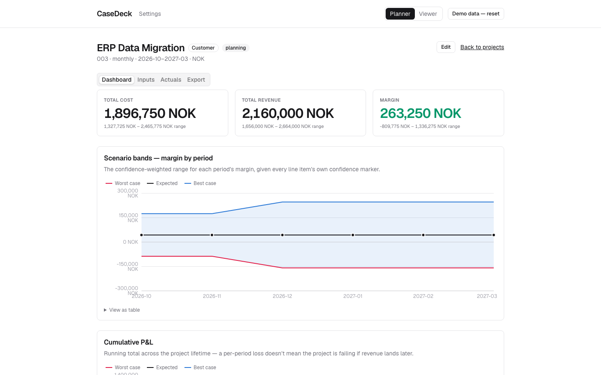
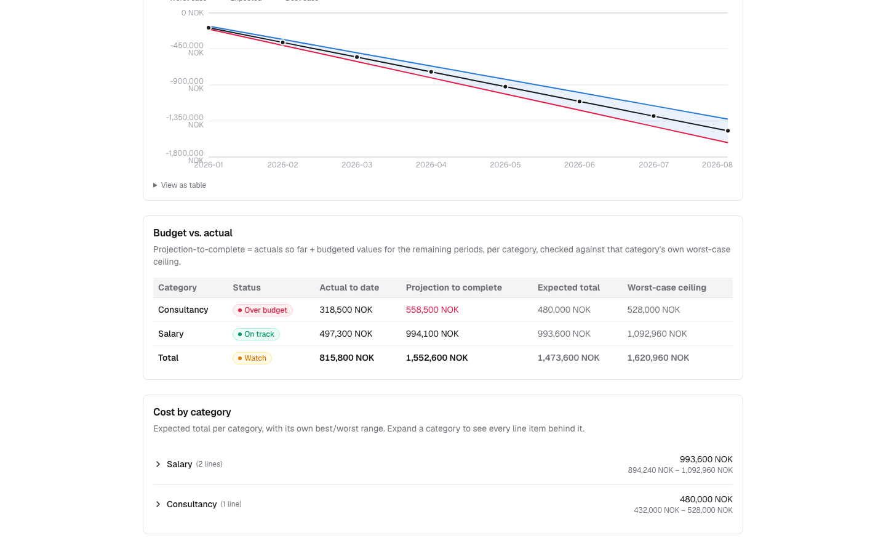
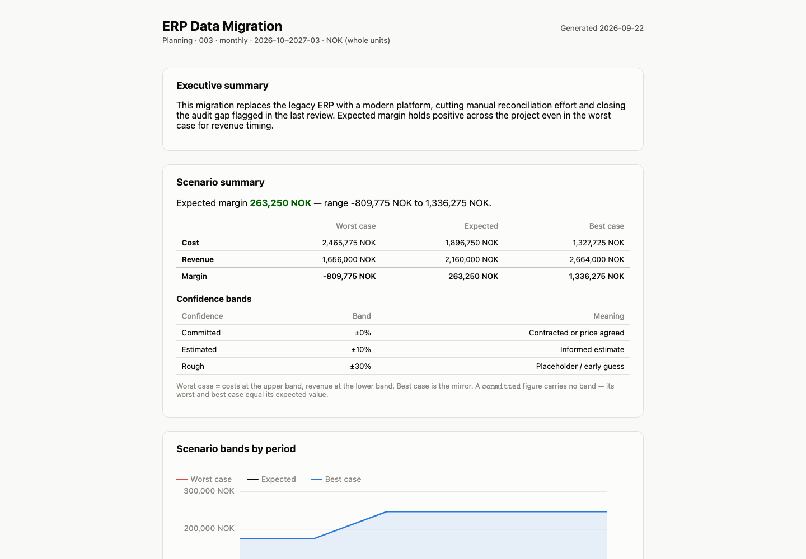
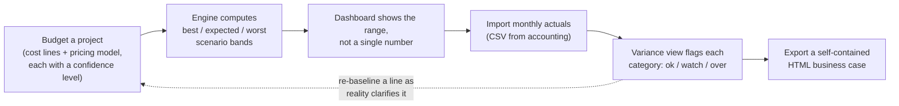

# CaseDeck

Budget a project, see best/expected/worst scenarios driven by how confident you actually are in
each number, export a self-contained business case your CFO can open from an email — then keep the
same file honest by importing recorded actuals as the project runs. Built for project managers who
budget, not for accountants.

Most budgeting tools give you one number. CaseDeck gives you a range, weighted by how sure you
actually are of each line — and then tells you, category by category, whether reality is still
inside it.

## Screenshots

| Scenario bands (a range, not one number) | Budget vs. actual (caught before it's unrecoverable) |
|---|---|
|  |  |

| The exported business case |
|---|
|  |

## Live demo

**[casedeck-blue.vercel.app](https://casedeck-blue.vercel.app)** — boots pre-loaded with the demo
above, no setup, no account. Use the Planner/Viewer switcher in the header to see it from either
role.

## The problem

A budget with one number in every cell reads as more certain than it is. Early in a project, some
costs are locked (a signed contract) and others are still a guess (a rough sizing before scoping is
done) — but a spreadsheet shows both with the same confident precision, so the guess quietly gets
treated like the contract. Then the budget gets approved, the project runs, and the spreadsheet
stops being updated — nobody notices a category quietly drifting over budget until the total is
already unrecoverable, because nothing was actively comparing plan to reality along the way.

CaseDeck attacks both halves of that at once: every line item carries an honest confidence level
that drives a best/expected/worst range instead of a single number, and every category gets checked
against actual spend as it comes in, flagged before the project-level total would ever show a
problem.

## How it works



Everything left of the dashboard is deterministic, pure-function TypeScript (`src/engine/`) — no
AI, no network, unit- and property-tested. AI only shows up at the edges, as two Claude Code skills
that run *outside* the app: `/setup` interviews you to turn a raw budget export into CaseDeck's
format, and `/business-case` drafts narrative text for the export — both cite numbers a deterministic
CLI already computed; neither is ever the thing doing the arithmetic (see `CLAUDE.md`).

## Quickstart

**Reviewing this as a portfolio piece?** Open the live demo link above — it boots pre-loaded with
a fictional company's three projects, no setup, no account. The dashboard, variance view, and
export tab above are all live in the demo, not mockups.

**Want to use it for your own project?** Fork the repo and deploy it (see `DEPLOYMENT.md` for the
one-click and internal-hosting options), then run the `/setup` Claude Code skill against your own
budget export — it interviews you and writes the config for your organization. `HANDBOOK.md` covers
the recurring monthly workflow once you're set up.

**Developer, want to run or extend it?**

```bash
pnpm install
pnpm dev             # local dev server at localhost:3000, boots the demo data
pnpm lint
pnpm typecheck
pnpm test:coverage   # unit + property tests, engine coverage gate
pnpm lint:boundaries # engine-purity import boundary (dependency-cruiser)
pnpm test:e2e        # Playwright smoke suite
pnpm build           # static export to out/ — no server, no API routes
```

## Architecture, briefly

- **Local-first, no backend.** Everything persists to IndexedDB in your browser through a single
  `StorageAdapter` interface (`src/storage/`) — a static export (`next build`) is the entire app.
  See `DEPLOYMENT.md` for what that does and doesn't mean for multi-user use.
- **Engine purity.** `src/engine/` and `src/import/` never import React, Next, or the DOM — plain,
  pure, unit-tested TypeScript, enforced in CI by dependency-cruiser. The UI is a thin, replaceable
  layer over deterministic scenario math (`src/engine/scenarios.ts`) and variance/projection-to-
  complete tracking (`src/engine/variance.ts`).
- **Config, not code, for anything org-specific.** Category mappings, rate cards, loaded-cost
  multipliers, currency, and confidence-band percentages live in `config/`, never hardcoded. The
  in-app Settings page lets a Planner tune rate cards, multipliers, and confidence bands per
  deployment; edits are stored as overrides merged over the bundled config at read time, so
  `config/` itself stays untouched.
- **AI at the edges only.** Claude never computes a number that ends up in app output — see "How it
  works" above and `CLAUDE.md`.
- **Self-contained export.** `src/export/` is a separate, hand-rolled SVG/HTML generator (not
  Recharts, not a shipped React runtime) — the output opens from `file://` with networking
  disabled.

Full engineering plan: `PLAN.md`. Product intent and the bet behind building this: `casedeck.prd.md`.
Data formats: `DATA_REQUIREMENTS.md`. Deployment tiers: `DEPLOYMENT.md`. What's deliberately out of
v1 and why: `ROADMAP.md`.

## License

MIT — see `LICENSE`.
